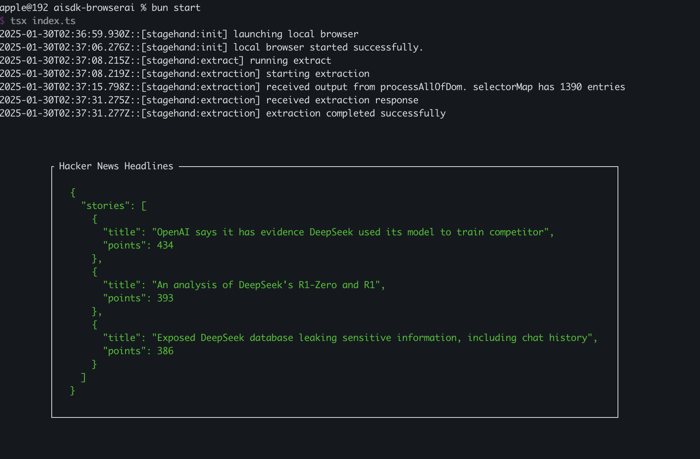

# 🤘 Welcome to Deepseek Operator (OpenAI Operator Alternative)!

Hey! This is a project built with BrowserBase StageHand [DeepSeek Operator](https://github.com/essamamdani/deepseek-operator).

## Prerequisites

- **Node.js**: Ensure you have Node.js installed. You can download it from [nodejs.org](https://nodejs.org/).

- **Package Manager**: Depending on your preference, ensure you have one of the following package managers installed:
  - [npm](https://www.npmjs.com/)
  - [Yarn](https://yarnpkg.com/)
  - [Bun](https://bun.sh/)

## Installation Steps

1. **Clone the Repository**:

```bash
git clone https://github.com/essamamdani/deepseek-operator
cd deepseek-operator
```

  2.  Set Up Environment Variables:
  • Duplicate the example environment file:
```bash
cp .env.example .env
```

  • Open the .env file and configure the following variables:
  • `GROQ_API_KEY`: Add your API key here. [Grab an API Key](https://console.groq.com/keys)
  • For Local Development:
  • Set `BROWSERBASE_LOCAL=true`
  • Leave `BROWSERBASE_PROJECT_ID` and `BROWSERBASE_API_KEY` as they are.
  • For Production:
  • Obtain the necessary keys from BrowserBase and set them accordingly.

  3.  Install Dependencies:
Depending on your chosen package manager, run one of the following commands:
```bash
npm install
```


  4.  Start the Application:
To launch the application, use the command corresponding to your package manager:
```bash
npm run start
```

### Result:
Once the application starts successfully, you'll see the following interface:



### Additional Information
  • DeepSeek API: The DeepSeek API is compatible with the OpenAI API format. By adjusting your configuration, you can utilize the OpenAI SDK or other software compatible with the OpenAI API to access the DeepSeek API. (api-docs.deepseek.com)
  • Local Deployment: If you’re interested in running DeepSeek R1 locally, comprehensive guides are available to assist you with the setup. (https://www.essamamdani.me/how-to-run-deepseek-r1-locally-a-comprehensive-guide)

For more detailed information and resources, please refer to the official DeepSeek documentation.

## License

This project is licensed under the MIT License. See the [LICENSE](LICENSE) file for details.

## Author

Essa Mamdani - [essamamdani.com](https://essamamdani.me)

## Contributing

Contributions are welcome! Please feel free to submit a Pull Request.
